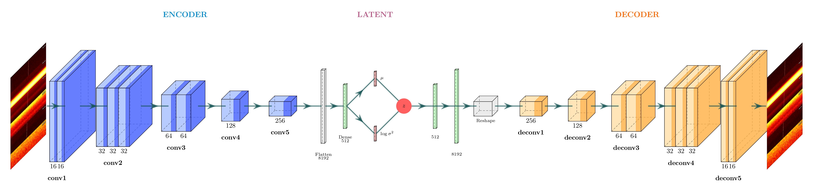

# System Architecture

This document describes the technical architecture of the ML-SRT-SETI signal detection pipeline.

## Overview

The pipeline uses a two-stage approach:
1. **β-VAE** learns a compressed latent representation of radio observations
2. **Random Forest** classifies cadence patterns as ETI or RFI

## Data Flow

```
┌──────────────────────────────────────────────────────────────────┐
│                         INPUT                                    │
│  6 observations × 16 time bins × 4096 frequency channels         │
└─────────────────────────────┬────────────────────────────────────┘
                              │
                              ▼
┌──────────────────────────────────────────────────────────────────┐
│                     PREPROCESSING                                │
│  1. Downscale 8x: (6, 16, 4096) → (6, 16, 512)                   │
│  2. Log normalize per-snippet: all 6 obs together                │
│  3. Add channel dim: (6, 16, 512, 1)                             │
└─────────────────────────────┬────────────────────────────────────┘
                              │
                              ▼
┌──────────────────────────────────────────────────────────────────┐
│                       VAE ENCODER                                │
│  9 Conv2D layers → Flatten → Dense(512) → z_mean, z_log_var      │
│  Output: 8-dimensional latent vector per observation             │
└─────────────────────────────┬────────────────────────────────────┘
                              │
                              ▼
┌──────────────────────────────────────────────────────────────────┐
│                    LATENT COMBINATION                            │
│  Concatenate 6 latent vectors: 6 × 8 = 48 dimensions             │
└─────────────────────────────┬────────────────────────────────────┘
                              │
                              ▼
┌──────────────────────────────────────────────────────────────────┐
│                    RANDOM FOREST                                 │
│  Input: 48D vector                                               │
│  Output: P(ETI) probability                                      │
└──────────────────────────────────────────────────────────────────┘
```

## VAE Architecture

The β-VAE follows a symmetric encoder-decoder structure. During training, both components work together: the **encoder** compresses the input spectrogram into a compact latent representation, and the **decoder** attempts to reconstruct the original spectrogram from that representation. The reconstruction loss ensures that the latent space retains enough information to faithfully represent the input data.



However, the ultimate goal of the pipeline is not reconstruction — it is **classification**. The VAE acts as a feature extractor: once the model has learned a meaningful latent space, only the **encoder** is needed at inference time. Each observation is encoded into an 8-dimensional latent vector, and it is this vector — not the reconstructed spectrogram — that is passed to the Random Forest classifier. The decoder is discarded after training.

### Encoder

The encoder maps each observation spectrogram `(16, 512, 1)` to an 8-dimensional latent vector through 9 convolutional layers with progressively increasing filters (16 → 32 → 64 → 128 → 256), followed by a dense layer and two output heads for **z_mean** (μ) and **z_log_var** (log σ²).

### Latent Space

The latent code **z** is sampled using the **reparameterization trick**:

```
z = μ + σ × ε,    ε ~ N(0, I)
```

This allows gradients to flow through the sampling operation during backpropagation. Each observation is encoded into an **8-dimensional** latent vector.

### Decoder

The decoder mirrors the encoder architecture using 9 transposed convolutional layers to reconstruct the input spectrogram `(16, 512, 1)` from the latent vector. It is used **only during training** to compute the reconstruction loss and is not part of the inference pipeline.

**Total VAE parameters**: ~9.3M (Encoder: 4.65M + Decoder: 4.65M)

## Loss Function

The VAE uses a composite loss:

```
Total Loss = Reconstruction + β × KL + α × (True_Clustering + False_Clustering)
```

| Component | Weight | Purpose |
|-----------|--------|---------|
| Reconstruction | 1.0 | Faithful data reconstruction |
| KL Divergence | β=1.5 | Regularize latent space |
| True Clustering | α=10 | ON observations cluster together, separate from OFF |
| False Clustering | α=10 | All observations cluster together (RFI pattern) |

### Clustering Loss Details

The clustering loss is a contrastive term that shapes the latent space based on the expected cadence structure of SETI observations. Each cadence consists of **6 observations** alternating between the target source (ON) and nearby off-target positions (OFF):

```
Obs 1 (ON) → Obs 2 (OFF) → Obs 3 (ON) → Obs 4 (OFF) → Obs 5 (ON) → Obs 6 (OFF)
```

A genuine ETI signal would appear **only** in the ON observations (1, 3, 5), since it comes from a fixed point in the sky. RFI, instead, affects **all** observations regardless of pointing direction.

The clustering loss encodes this distinction using two distance primitives on the latent vectors:

- **loss_same(a, b)** = mean Euclidean distance ‖a − b‖ → minimized to **attract** vectors
- **loss_diff(a, b)** = 1 / (‖a − b‖ + ε) → minimized to **repel** vectors

#### True Clustering (ETI pattern)

For cadences containing genuine signals, the loss enforces **two separate clusters** in the latent space:

- **Intra-group attraction**: ON observations (1, 3, 5) are pulled together; OFF observations (2, 4, 6) are pulled together (using `loss_same`)
- **Inter-group repulsion**: ON vectors are pushed away from OFF vectors (using `loss_diff`)

```
L_true = Σ loss_same(ON_i, ON_j) + Σ loss_same(OFF_i, OFF_j) + Σ loss_diff(ON_i, OFF_j)
```

This forces the encoder to learn representations where observations containing a signal are clearly separable from those without it.

#### False Clustering (RFI/noise pattern)

For cadences without genuine signals (only noise or RFI), **all 6 observations should look the same**, since there is no directional signal:

- **All pairs attracted**: all observations — both ON and OFF positions — are pulled together (using `loss_same` for every pair)

```
L_false = Σ loss_same(obs_i, obs_j)    ∀ i, j
```

This ensures that when no signal is present, the encoder maps all observations in a cadence to the **same region** of the latent space.

#### Combined Effect

Together, these two losses teach the encoder to produce latent representations where the **pattern of distances within a cadence** is itself the discriminative feature: a cadence with a real signal will show two distinct clusters (ON vs OFF), while a noise-only cadence will show a single tight cluster. The downstream Random Forest classifier can then easily distinguish these two patterns from the concatenated 48D vector (6 × 8 latent dims).

## Random Forest Classifier

| Parameter | Value |
|-----------|-------|
| n_estimators | 1000 |
| max_features | sqrt |
| max_depth | None |
| min_samples_split | 2 |
| Input features | 48 (6 obs × 8 latent dims) |
| Output | P(ETI) |

## Regularization

| Layer | L1 Weight | L2 Weight |
|-------|-----------|----------|
| Dense | 0.001 | 0.01 |
| z_mean | 0.001 | 0.01 |
| z_log_var | 0.001 | 0.01 |

## Key Design Decisions

### Per-Snippet Normalization
The entire 6-observation snippet (6×16×512) is normalized together, not per-observation. This preserves the relative contrast between ON and OFF observations, which is crucial for detecting signals that appear only in ON.

### Latent Dimension (8)
Compact enough to avoid overfitting, expressive enough to capture relevant features.

### 8x Downscaling
Reduces computational load while preserving signal structure. Narrowband signals are still detectable after downscaling.

## Code References

- **VAE Model**: `src/models/vae.py`
- **Preprocessing**: `src/utils/preprocessing.py`
- **Training**: `scripts/train_large_scale.py`
- **Inference**: `src/inference/pipeline_optimized.py`
