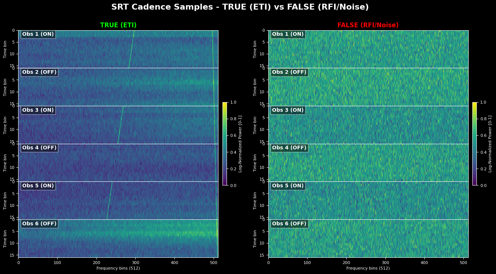

# Dataset Documentation

This document describes the data format, generation process, and preprocessing pipeline for ML-SRT-SETI.

## Data Format

### Input: H5 Files

Raw observations are stored in `.h5` format, loaded via [blimpy](https://github.com/UCBerkeleySETI/blimpy):

```python
from blimpy import Waterfall
wf = Waterfall("observation.h5")
data = wf.data.squeeze()  # (time, freq)
```

### Cadence Structure

Each analysis unit is a **6-observation cadence** following the ON-OFF pattern:

| Index | Type | Name | Description |
|-------|------|------|-------------|
| 0 | ON | A1 | First target observation |
| 1 | OFF | B | First reference observation |
| 2 | ON | A2 | Second target observation |
| 3 | OFF | C | Second reference observation |
| 4 | ON | A3 | Third target observation |
| 5 | OFF | D | Third reference observation |

**Dimensions** (raw): `(6, 16, 4096)` — 6 observations × 16 time bins × 4096 frequency channels

**Dimensions** (processed): `(6, 16, 512, 1)` — after 8x downscaling + channel dimension

---

## Signal Generation

Signal injection uses [setigen](https://github.com/bbrzycki/setigen) to create synthetic narrowband drifting signals.

### Sample Types



#### True Samples (ETI-like Pattern)

Signal appears **only in ON observations** (A1, A2, A3), simulating an extraterrestrial transmitter.

```text
Implementation: src/data/cadence_generator.py:create_true_sample_fast()

Process:
1. Get background (real SRT or synthetic noise)
2. Stack all 6 observations vertically
3. Inject first signal through entire stack
4. Inject second signal through entire stack
5. Return: ON gets both signals, OFF gets only first
```

This creates a distinguishable pattern where ON observations have different spectral content than OFF.

#### False Samples (RFI/Noise Pattern)

Signal appears **in all observations equally** (or no signal at all).

```text
Implementation: src/data/cadence_generator.py:create_false_sample()

50% RFI Pattern: Same signal in all 6 observations
50% Pure Noise:  Background only, no signal injection
```

### Signal Parameters

| Parameter | Value | Source |
|-----------|-------|--------|
| SNR Range | 10-50 | `--snr-base 10 --snr-range 40` |
| Drift Rate | Calculated to traverse observation | `SignalGenerator._calculate_drift_rate()` |
| Width | 50 + 18 × \|drift_rate\| Hz | `SignalGenerator._calculate_width()` |
| Profile | Gaussian frequency profile | setigen `gaussian_f_profile` |

---

## Preprocessing Pipeline

### Step 1: Frequency Downscaling

Reduces frequency resolution 8x while preserving signal structure:

```python
from src.utils.preprocessing import downscale

# Input: (batch, 6, 16, 4096) or (6, 16, 4096)
# Output: (batch, 6, 16, 512) or (6, 16, 512)
downscaled = downscale(data, factor=8)
```

Uses `skimage.transform.downscale_local_mean` for local averaging.

### Step 2: Per-Snippet Log Normalization

> [!IMPORTANT]
> All 6 observations are normalized **together** (per-snippet), not individually. This preserves the relative contrast between ON and OFF observations.

```python
from src.utils.preprocessing import preprocess

# Normalizes entire (6, 16, 512) snippet together
# Adds channel dimension: (6, 16, 512, 1)
processed = preprocess(data, add_channel=True)
```

**Algorithm** (from `normalize_log()`):

```python
log_data = np.log(data)                    # Log transform
log_data = log_data - log_data.min()       # Shift to 0
log_data = log_data / log_data.max()       # Scale to [0, 1]
```

### Complete Pipeline

```python
from src.utils.preprocessing import preprocess, downscale

# Raw: (6, 16, 4096)
downscaled = downscale(raw_data, factor=8)    # (6, 16, 512)
processed = preprocess(downscaled, add_channel=True)  # (6, 16, 512, 1)
```

---

## SRT Background Plate

For realistic training, real SRT backgrounds can be used instead of synthetic noise.

### Format

```python
# Load plate
plate = np.load("srt_backgrounds.npz")
backgrounds = plate["backgrounds"]  # Shape: (N, 6, 16, 4096)
```

### Usage

```bash
# Training with real backgrounds
python experiments/train_large_scale.py \
    --plate data/srt_training/srt_backgrounds.npz \
    --batches 15 --samples 2500

# Training with synthetic noise (fallback)
python experiments/train_large_scale.py --no-plate
```

---

## Data Generation for Training

Training generates fresh data each batch using multiprocessing:

```python
# From train_large_scale.py
from multiprocessing import Pool

def generate_training_data(num_samples, seed):
    with Pool(NUM_WORKERS, initializer=_init_worker, 
              initargs=(SRT_PLATE_PATH,)) as pool:
        vae_cadences = pool.imap(_generate_true_sample, args)
        true_cadences = pool.imap(_generate_true_sample, args)
        false_cadences = pool.imap(_generate_false_sample, args)
    # ...
```

### Data Format for Training

| Dataset | Shape | Purpose |
|---------|-------|---------|
| `vae_data` | (N×6, 16, 512, 1) | Flattened for VAE input |
| `true_data` | (N×6, 6, 16, 512, 1) | Cadences for clustering loss |
| `false_data` | (N×6, 6, 16, 512, 1) | Cadences for clustering loss |

---

## Code References

- Cadence Generator: `src/data/cadence_generator.py`
- Signal Injection: `src/data/signal_generator.py`
- Noise Generation: `src/data/noise_generator.py`
- Preprocessing: `src/utils/preprocessing.py`
- Data Loading: `src/data/loader.py`
